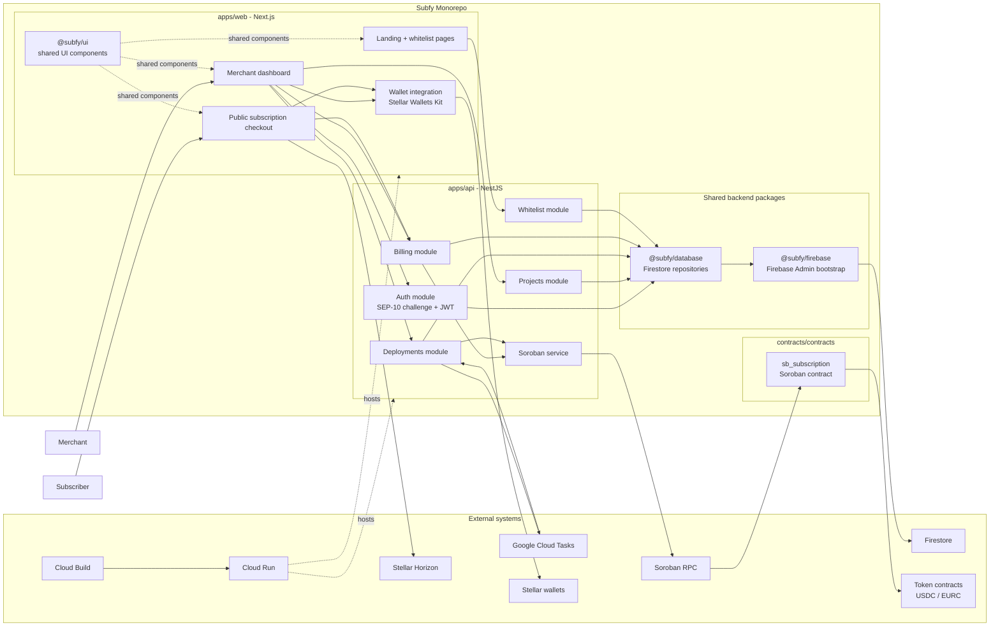
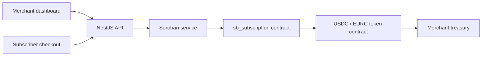
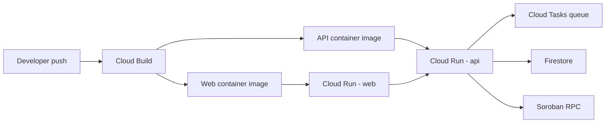

# Subfy Technical Architecture

## Overview

Subfy is a `pnpm`/Turbo monorepo that combines:

- A `Next.js` web application for merchants and subscribers
- A `NestJS` API that orchestrates authentication, project management, contract deployment, and billing
- A Soroban smart contract (`sb_subscription`) that stores plans and subscriptions on-chain
- Shared workspace packages for UI, Firebase bootstrapping, and Firestore data access

The architecture is intentionally split between:

- Off-chain orchestration and persistence in the API + Firestore
- On-chain subscription state and payment enforcement in Soroban

## Component Diagram

## Runtime Responsibilities

### `apps/web`

- Serves the marketing site, merchant dashboard, public subscription checkout, and whitelist pages
- Connects to Stellar wallets for login and transaction signing
- Calls the API for authenticated merchant actions and public checkout actions
- Uses Horizon directly for trustline and balance pre-checks on the subscriber side

### `apps/api`

- Issues and verifies SEP-10 style wallet authentication challenges
- Stores users, projects, deployments, whitelist entries, and WASM release metadata in Firestore
- Prepares unsigned Soroban transactions for user wallet signing
- Executes backend-signed on-chain operations for admin flows such as contract initialization, plan management, and due renewals
- Acts as both the public API and the internal deployment worker endpoint

### `contracts/contracts/sb_subscription`

- Stores subscription plans and subscriber state on-chain
- Supports `init`, `create_plan`, `set_plan_status`, `subscribe`, `renew`, `cancel`, and list/read methods
- Charges the initial subscription directly from the subscriber
- Charges renewals through token allowance approved by the subscriber

## Soroban Contract Focus

The contract layer is the core of the billing model. Off-chain services decide who can operate on a project, but the recurring billing state itself lives in the `sb_subscription` Soroban contract.

### Contract Role In The System

- `apps/api` uses the contract as the source of truth for plans and subscriptions
- `apps/web` never talks to the contract directly; it always goes through API-prepared transactions
- The contract enforces subscription lifecycle rules on-chain
- The contract transfers tokens to the merchant treasury during `subscribe` and `renew`

### Contract Structure

The current Soroban workspace contains one main contract:

- `contracts/contracts/sb_subscription`: recurring subscription manager written in Rust with `soroban-sdk`

This contract is compiled to WASM, registered as a release by the backend, then deployed per project. Each merchant project ends up with its own contract instance.

### On-Chain Storage Model

The contract uses Soroban instance and persistent storage for the following state:

- `Admin`: the address allowed to manage plans
- `PaymentToken`: the token contract used for billing
- `Treasury`: the destination address that receives subscription payments
- `PlanCount` and `PlanIndex(n)`: indexes for paginated plan listing
- `SubscriberCount`, `SubscriberIndex(n)`, and `SubscriberSeen(address)`: indexes for subscriber pagination
- `Plan(plan_id)`: plan definition
- `Subscription(subscriber)`: subscription state for a wallet

This design is important because the contract does not only store the current subscription state. It also maintains index structures so the backend can paginate plans and subscriptions through `list_plans`, `list_subscribers`, and `list_subscriptions`.

### Main On-Chain Types

- `Plan`
  - `id`
  - `name`
  - `period_ledgers`
  - `price_stroops`
  - `active`
- `Subscription`
  - `subscriber`
  - `plan_id`
  - `started_ledger`
  - `next_renewal_ledger`
  - `active`

`period_ledgers` is the billing period unit. Instead of storing time in days or months, the contract measures renewal windows in Stellar ledgers.

### Contract API

#### Administrative methods

- `init(admin, payment_token, treasury)`
  - Initializes the contract once
  - Stores the admin, payment token contract, and treasury address
- `create_plan(caller, plan_id, name, period_ledgers, price_stroops)`
  - Creates a new active plan
  - Rejects duplicate plan IDs, zero period, and non-positive price
- `set_plan_status(caller, plan_id, active)`
  - Enables or disables a plan

#### Subscriber methods

- `subscribe(subscriber, plan_id)`
  - Requires subscriber auth
  - Checks that the plan exists and is active
  - Transfers the initial payment from subscriber to treasury
  - Creates or reactivates subscription state
- `cancel(subscriber)`
  - Requires subscriber auth
  - Marks the subscription inactive
- `renew(subscriber)`
  - Does not require subscriber auth at execution time
  - Can only run when the renewal ledger is due
  - Pulls funds using token allowance via `transfer_from`
  - Advances `next_renewal_ledger`

#### Read methods

- `get_plan(plan_id)`
- `get_subscription(subscriber)`
- `list_plans(offset, limit)`
- `list_subscribers(offset, limit)`
- `list_subscriptions(offset, limit)`

### Soroban Billing Flow

### Subscription Execution Model

#### Initial subscription

1. The subscriber chooses a plan in the checkout page.
2. The API prepares an unsigned `subscribe` transaction for the deployed `sb_subscription` contract.
3. The wallet signs the transaction.
4. The API submits the signed XDR to Soroban.
5. The contract calls the payment token contract to transfer the first payment from subscriber to treasury.
6. The contract stores a new `Subscription` with the next renewal ledger.

#### Renewal

1. After subscribing, the user can sign a token `approve` transaction that grants allowance to the subscription contract.
2. When a renewal becomes due, the backend can call `renew(subscriber)`.
3. The contract checks:
   - the subscription exists
   - the subscription is active
   - the plan is still active
   - the current ledger is at or after `next_renewal_ledger`
4. The contract pulls funds from the subscriber via the token contract using `transfer_from`.
5. The contract updates `next_renewal_ledger`.

This split is central to the Subfy model:

- `subscribe` performs an immediate charge
- `renew` performs a delegated charge backed by token allowance

### Contract And Backend Responsibilities

The system deliberately separates concerns:

- The contract is responsible for billing rules and token movement
- Firestore is responsible for project ownership, deployment metadata, and release registry
- The API is responsible for authorization, orchestration, transaction preparation, and background execution

One important architectural detail is that the backend signer becomes the effective contract admin during initialization. Merchant ownership is enforced off-chain by the API, while on-chain administrative calls are executed by the backend signer.

### Contract Guardrails

The contract already encodes several safety rules:

- Single initialization only
- Admin-only plan management
- Maximum page size for list endpoints
- No subscription to inactive plans
- No renewal before due ledger
- No renewal on cancelled subscriptions
- Positive price and non-zero period validation

### Contract Test Coverage

The Rust tests currently validate the most important contract scenarios:

- full subscription lifecycle
- unauthorized plan creation
- rejection of inactive plans
- renewal requiring both due ledger and allowance
- pagination of plans and subscriptions

This is a good sign for the architecture because the core billing guarantees are tested at the contract layer rather than only in the API.

### Shared packages

- `@subfy/firebase`: initializes Firebase Admin and provides Firestore access
- `@subfy/database`: exposes Firestore-backed services for `users`, `projects`, `deployments`, `whitelist`, and `wasmReleases`
- `@subfy/ui`: shared design system used by the web application

## Key Runtime Flows

### 1. Wallet Authentication

1. The merchant connects a Stellar wallet in the web app.
2. The web app requests a challenge from the API.
3. The wallet signs the challenge transaction.
4. The API verifies the wallet signature, upserts the user in Firestore, and returns a JWT.

### 2. Project Creation and Contract Deployment

1. The merchant creates a project from the dashboard.
2. The API stores the project in Firestore with off-chain metadata such as network, treasury address, and payment currency.
3. The API prepares a Soroban contract deployment transaction using the latest registered `sb_subscription` WASM release.
4. The merchant wallet signs the deployment transaction in the web app.
5. The API stores a deployment record and either executes it directly in development or enqueues it through Google Cloud Tasks in production.
6. The worker submits the signed deployment transaction, obtains the new contract ID, initializes the contract, and updates the project record in Firestore.

### 3. Merchant Billing Administration

1. The merchant dashboard calls authenticated billing endpoints.
2. The API validates project ownership in Firestore.
3. The API reads or writes billing state on the Soroban contract.
4. Plans and subscriptions are returned to the dashboard for management views.

### 4. Subscriber Checkout

1. A subscriber opens the public checkout page for a project.
2. The web app fetches checkout context from the API.
3. The web app checks trustline and token balance through Horizon.
4. The API prepares unsigned contract or token transactions.
5. The subscriber wallet signs the transaction.
6. The API submits the signed XDR to Soroban RPC.
7. The contract updates subscription state and transfers tokens to the merchant treasury.

### 5. Renewal Execution

1. The merchant triggers `renew due` from the dashboard.
2. The API scans paginated subscriptions from the on-chain contract.
3. For each due subscription, the API invokes `renew`.
4. The contract pulls funds using the subscriber's token allowance and transfers them to the treasury.

## Data Ownership Model

- Firestore stores off-chain application records:
  - users
  - projects
  - deployments
  - whitelist entries
  - WASM releases
- Soroban stores on-chain billing records:
  - plan definitions
  - subscriber state
  - renewal schedule
- Token contracts store balances and allowances for `USDC` / `EURC`

## Soroban Interaction Map

The API touches the contract in three distinct ways:

- Deployment path
  - prepares deployment XDR
  - submits signed deployment
  - calls `init(...)` after deployment succeeds
- Merchant admin path
  - reads `list_plans(...)` and `list_subscriptions(...)`
  - writes `create_plan(...)`, `set_plan_status(...)`, and `renew(...)`
- Subscriber checkout path
  - reads `get_plan(...)`, `get_subscription(...)`, and token `allowance(...)`
  - prepares unsigned `subscribe(...)`, `cancel(...)`, and token `approve(...)` transactions
  - submits user-signed XDRs

## Deployment View

## Architectural Notes

- The API is the orchestration boundary of the system.
- Firestore is used for application state, not for subscription truth.
- Subscription truth lives in the `sb_subscription` contract.
- The web app never writes directly to Firestore or Soroban.
- Production deployment work is asynchronous, but the worker still lives inside the API service.
- Renewals are manually triggered from the dashboard in the current implementation; there is no separate scheduler service in the repository.
